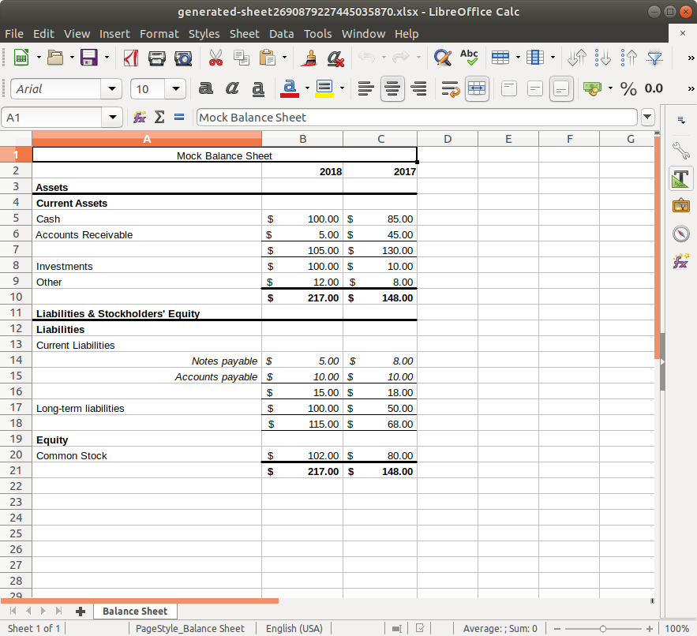
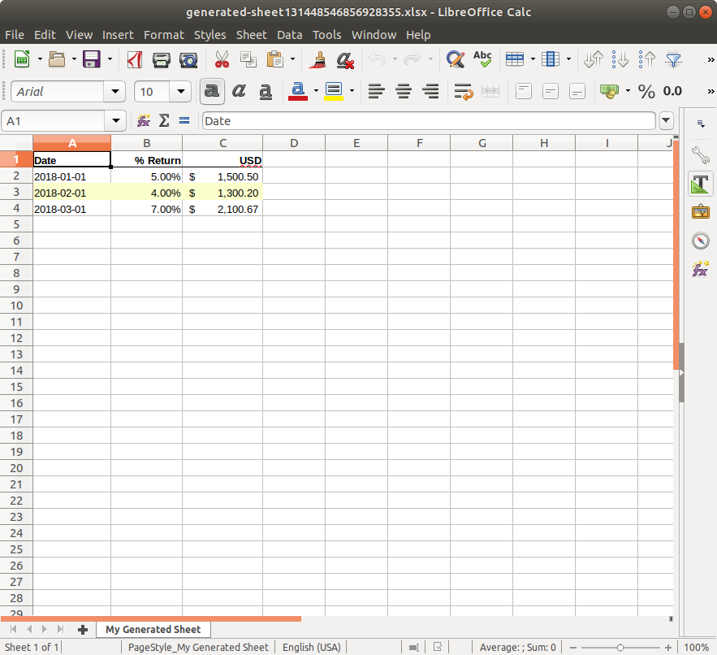
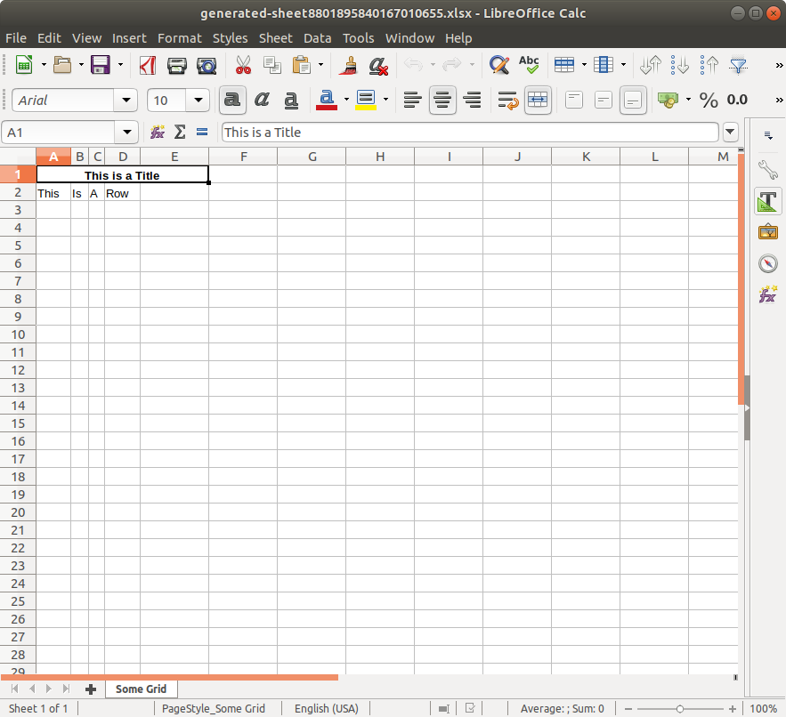

# excel-clj

Declarative generation of Excel documents & PDFs with Clojure from higher level 
abstractions (tree, table) or via a manual grid specification, with boilerplate-free 
common sense styling.

[CHANGELOG](CHANGELOG.md) | Uses [Break Versioning](https://github.com/ptaoussanis/encore/blob/master/BREAK-VERSIONING.md)

Lein:
```
[org.clojars.mjdowney/excel-clj "1.1.1"]
```

- [Getting Started](#getting-started)
    - [Tables](#tables)
    - [Trees](#trees)
    - [PDF Generation](#pdf-generation)
    - [Table Styling](#table-styling)
    - [Tree Styling](#tree-styling)
    - [Manual Styling](#manual-styling)
    - [Grid Format & Cell Merging](#grid-format-&-cell-merging)
- [Roadmap](#roadmap)
    - [Tree flexibility](#roadmap)
    - [Templates](#roadmap)
    - [Reading & editing](#roadmap)
    - [Formulas](#roadmap)

## Getting Started

All of the namespaces have an `example` function at the end; they're intended to
be browsable and easy to interact with to glean information beyond what's here
in a the readme.

Start by skimming this and then browsing [core.clj](src/excel_clj/core.clj).

Tests are run with

```clojure
lein test
```

### Tables
Though Excel is much more than a program for designing tabular layouts, a table
is a common abstraction that we impose on our data.

```clojure
(require '[excel-clj.core :as excel])
=> nil
(def table-data
  [{"Date" "2018-01-01" "% Return" 0.05M "USD" 1500.5005M}
   {"Date" "2018-02-01" "% Return" 0.04M "USD" 1300.20M}
   {"Date" "2018-03-01" "% Return" 0.07M "USD" 2100.66666666M}])
=> #'user/table-data
(let [;; A workbook is any [key value] seq of [sheet-name, sheet-grid].
      ;; Convert the table to a grid with the table function.
      workbook {"My Generated Sheet" (excel/table table-data)}]
  (excel/quick-open workbook))
```


### Trees

Sometimes -- frequently for accounting documents -- we use spreadsheets to sum 
categories of numbers which are themselves broken down into subcategories.

For example, a balance sheet shows a company's assets & liabilities by summing
the balances corresponding to an account hierarchy.

```clojure
(def balance-sheet
  ["Mock Balance Sheet"
   [["Assets"
     [["Current Assets"
       [["Cash" {2018 100M, 2017 85M}]
        ["Accounts Receivable" {2018 5M, 2017 45M}]]]
      ["Investments" {2018 100M, 2017 10M}]
      ["Other" {2018 12M, 2017 8M}]]]
    ["Liabilities & Stockholders' Equity"
     [["Liabilities"
       [["Current Liabilities"
         [["Notes payable" {2018 5M, 2017 8M}]
          ["Accounts payable" {2018 10M, 2017 10M}]]]
        ["Long-term liabilities" {2018 100M, 2017 50M}]]]
      ["Equity"
       [["Common Stock" {2018 102M, 2017 80M}]]]]]]])

=> #'user/balance-sheet
(excel/quick-open {"Balance Sheet" (excel/tree balance-sheet)})
```



Trees are pretty flexible — the only requirement that we impose is that their
leaves have the format `[string-label, map-of-numbers]`. We construct trees 
using the same arguments we'd give to `clojure.core/tree-seq`, plus a walk 
function. 

We could make a tree for some part of our file system for example:

```clojure
(require '[excel-clj.tree :as tree] '[clojure.java.io :as io])
=> nil

(let [src-tree
      (tree/walk
        (fn [f xs]
          (if-not (seq xs)
            [(.getName f) {:size (.length f)}]
            [(str (.getName f) "/") xs]))
        #(.isDirectory %) #(.listFiles %) (io/file "."))]
  (excel/quick-open 
    {"Source Tree" (excel/tree ["Source" [src-tree]] :data-format :number)}))
```


### PDF Generation

If you're on a system that uses an OpenOffice implementation of Excel, PDF 
generation is similarly simple.

```clojure
(excel/quick-open-pdf 
  {"Mock Balance Sheet" (excel/tree balance-sheet) 
   "Some Table Data" (excel/table table-data)})
```


### Table Styling

The `table` function provides hooks to add custom styling without touching 
the generated grid, within the context of the table abstraction.

(More on the syntax of the style data in _Manual Styling_.)

- The `:data-style` keyword arg is a fn `(row-map, column-name) => style map`
- The `:header-style` keyword arg is a fn `(column name) => style map`

For instance, to highlight rows in our table where percent return is less than 
5%:

```clojure
(letfn [(highlight-below-5% [row-data col-name]
          (when (< (row-data "% Return") 0.05M)
            {:fill-pattern :solid-foreground
             :fill-foreground-color :yellow}))]
  (excel/quick-open
    {"My Generated Sheet" (excel/table table-data :data-style highlight-below-5%)}))
```



### Tree Styling

The tree function provides similar hooks to style the tree elements based on
their nested depth. Both keyword arguments expect a fn 
`(integer-depth) => style map` where the integer depth increases with nesting.

- `:total-formatters` is a function that controls styling for tree rows that 
  display totals of multiple subcategories
- `:formatters` is a function that controls styling for the rest of the tree

### Manual Styling

The code in this library wraps [Apache POI](https://poi.apache.org/). For 
styling, the relevant POI object is [CellStyle](https://poi.apache.org/apidocs/dev/org/apache/poi/ss/usermodel/CellStyle.html).

In order to insulate code from Java objects, style specification is done via maps,
for instance the style we saw above to highlight a row was:
```clojure 
{:fill-pattern :solid-foreground, :fill-foreground-color :yellow}
```

Under the hood however, all of the key/value pairs in the style maps correspond 
directly to setters within the POI objects. So if you browse the CellStyle 
documentation, you'll see `CellStyle::setFillPattern` and 
`CellStyle::setFillForegroundColor` methods. 

The map attributes are camel cased to find the appropriate setters, and the 
corresponding values are run through the multimethod 
[excel-clj.style/coerce-to-obj](src/excel_clj/style.clj) which dispatches on the
attribute name and returns some value that's appropriate to hand to POI.

If you're interested in greater detail, see the namespace documentation for 
[style.clj](src/excel_clj/style.clj), otherwise it's sufficient to know that enums are keyword-ized and
colors are either given as keywords (`:yellow`) or as RGB three-tuples 
(`[255 255 255]`).

### Grid Format & Cell Merging

The functions `table` and `tree` convert the source data into the grid format
which can go directly into the workbook map. The grid is `[[cell]]`, where each
`[cell]` represents a row.

The cell data are either plain values (String, Date, Number, etc.) or a map 
that includes optional style data / cell merging instructions.

```clojure
(let [title-style {:font {:bold true :font-height-in-points 10} :alignment :center}]
  (excel/quick-open 
    {"Some Grid" 
     [ [{:value "This is a Title" :width 5 :style title-style}] ;; Title row
       ["This" "Is" "A" "Row"] ;; Another row
      ]}))
```



## Roadmap

- Templates! There's no reason to do all of the styling work programmatically. 
  We should be able to download [some cool Google Sheets template](https://docs.google.com/spreadsheets/u/0/?usp=mkt_sheets_tpl)
  as an `.xlsx` file, edit it to indicate where `excel-clj` should fill in tables,
  trees, or individual cells, and then write code that reads the template from a
  `resources/some-template.xlsx` and produces a filled in sheet.
  
  Not at all a fully formed spec yet, but something along the lines of filling 
  in the following sheet:
  
  
  
  Using some simple data:
  ```clojure 
  {:title           "The Title"
   :start-date      (Date. (- (System/currentTimeMillis) (* 1000 60 60 24 7)))
   :end-date        (Date.)
   :employee-name   "Foo"
   :employee-id     "Bar"
   :manager-name    "Baz"
   :department      "Accounting"
   :expense-purpose "Trip"
   :tbl [{:date (Date.) :category "Cat A" :desc "Misc expenses" 
          :notes "" :amount 500.00M}
         {:date (Date.) :category "Cat B" :desc "Other expenses" 
          :notes "" :amount 100.00M}]}
  ```
  
  To get the following result:
  
  

- Reading & editing existing spreadsheets. This should go hand in hand with 
  template generation.
  
- Formulas! We don't have them. I'm envisioning a syntax where a table column
  or a cell contain a `:value` of `(excel/formula ...)`. The interior of the
  formula could allow relative coordinate generation with the placeholders `*x*` 
  and `*y*` — which could be operated on to find relative coordinates (e.g. 
  `(- *x* 2)`) — and would then be replaced during rendering with the column and 
  row. E.g. 
  
  ```clojure
  (def table-data
    [{"Foos" 10, "Bars" 5, "Total" (excel/formula "=(- *x* 2)*y* + (- *x* 1)*y*")}
     {"Foos" 12, "Bars" 8, "Total" (excel/formula "=(- *x* 2)*y* + (- *x* 1)*y*")}])
  ```
  
  would result in the formulas being rendered in the C column after the title 
  row, the first being `=A1+B1` and the second being `=A2+B2`.
  
- Java wrapper? Uncertain if this would be useful / how it would look.
